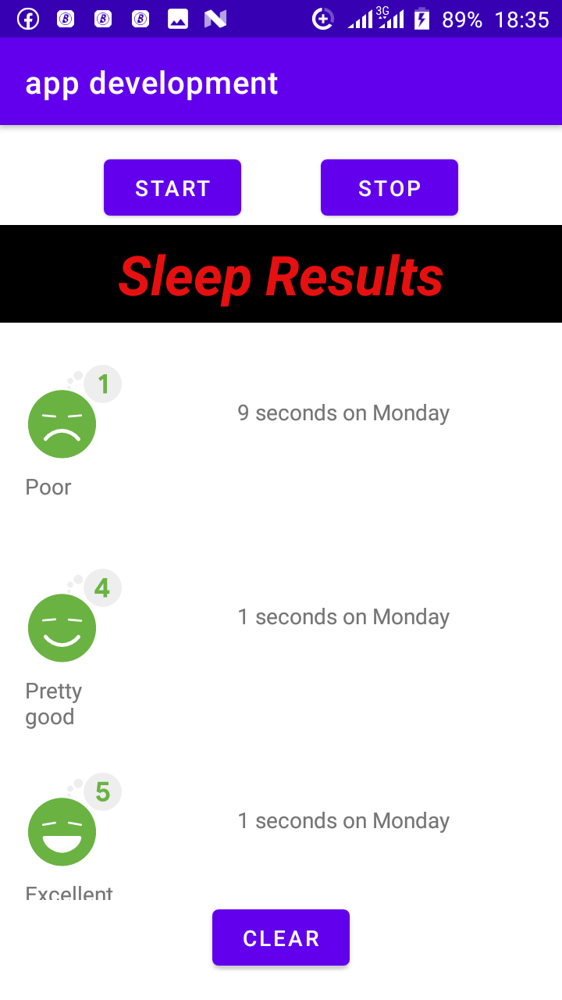

#

#### This project was build for learning purposes only it explains: 
#### some  functionalities of recycle view with headers ,safe_args(naviation),livedata etc,
##### withs headers however there are 3 apps in this file like i said there were built for learning
#### purposes uncomment each NaHost fragment in the activity_main.xml and run the app to see thereworking
###NOTE==you cannot uncomment more than one navHostFragment ContainerView at the same time

## Screenshots

  
